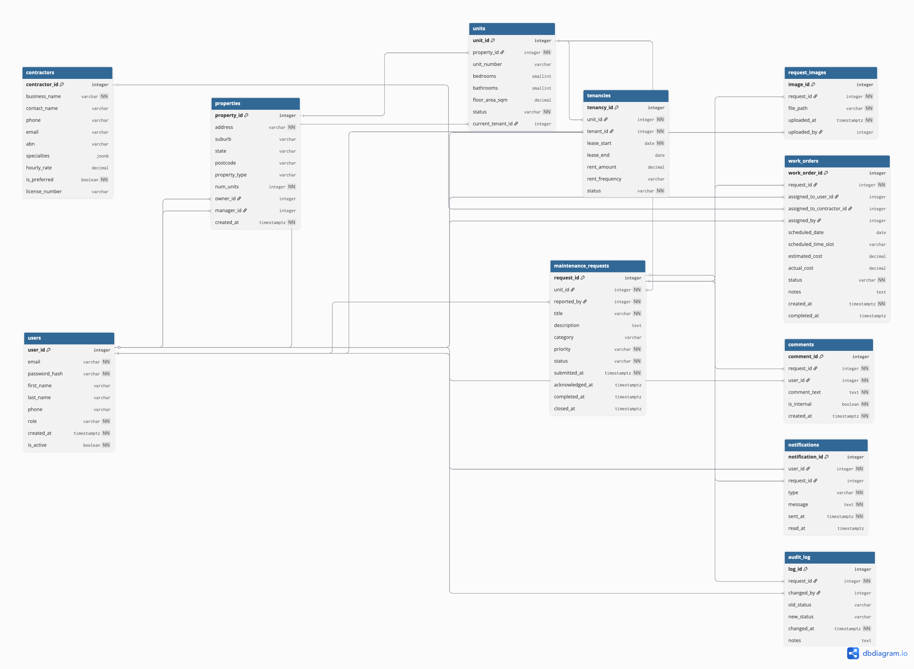

# Database Relationships

Written notes accompanying the ERD diagram below.
Source of truth: `db/schema.sql`.

The schema has **11 tables** organised into five concerns: people, properties, requests, work, and history. Every relationship below maps to a foreign key in `db/schema.sql`.

---

## 1. People and roles

**`users`** is the central identity table. Every person in the system — tenant, landlord, or property manager — is one row in `users` with a `role` value.

- `users.role` is constrained to one of: `tenant`, `landlord`, `property_manager`.
- The role determines what the application shows that user; the database does not split users into separate tables.

---

## 2. Properties, units, and tenancies

A **property** is a physical building. A **unit** is a rentable space inside that building (a single house has one unit; an apartment block has many).

- `properties.owner_id → users.user_id` — the **landlord** who owns the property.
- `properties.manager_id → users.user_id` — the **property manager** who manages the property on the landlord's behalf.
- `units.property_id → properties.property_id` — every unit belongs to one property.
- `units.current_tenant_id → users.user_id` — convenience pointer to the tenant currently living in the unit (nullable for vacant units).

**Tenancies** record the lease history — past, current, and terminated.

- `tenancies.unit_id → units.unit_id` — which unit is being leased.
- `tenancies.tenant_id → users.user_id` — which tenant holds the lease.
- A unit can have many tenancies over time, but only one with `status = 'active'` at any moment.

### Maps directly to the Trello requirements

| Required relationship | Where it lives |
|---|---|
| Tenants linked to properties they live in | `tenancies.tenant_id` + `units.property_id` |
| Landlords linked to properties they own | `properties.owner_id` |
| Property managers linked to properties they manage | `properties.manager_id` |

---

## 3. Maintenance requests

The core entity of the application. Every request is raised against a specific unit.

- `maintenance_requests.unit_id → units.unit_id` — which unit the issue is in.
- `maintenance_requests.reported_by → users.user_id` — who logged it (typically a tenant).
- `maintenance_requests.status` — workflow state, constrained to: `submitted`, `acknowledged`, `in_progress`, `awaiting_parts`, `awaiting_landlord_approval`, `landlord_approved`, `completed`, `closed`.
- `maintenance_requests.priority` — one of `low`, `medium`, `high`, `urgent`.
- `maintenance_requests.category` — one of `plumbing`, `electrical`, `structural`, `appliance`, `pest`, `general`.

Timestamps (`submitted_at`, `acknowledged_at`, `completed_at`, `closed_at`) record when the request moved through key milestones.

---

## 4. Evidence and conversation

A maintenance request can collect photos and a discussion thread.

- `request_images.request_id → maintenance_requests.request_id` — every photo belongs to one request.
- `request_images.uploaded_by → users.user_id` — who uploaded it.
- `comments.request_id → maintenance_requests.request_id` — every comment belongs to one request.
- `comments.user_id → users.user_id` — who wrote it.
- `comments.is_internal` — flag for PM-only notes hidden from tenants.

Both tables cascade-delete: if a maintenance request is deleted, its images and comments go with it.

---

## 5. Work allocation and contractors

Once a PM acts on a request, a **work order** is created and assigned either to an internal user or an external contractor.

- `contractors` is a standalone table of trade businesses (no FK in — they are independent of users).
- `work_orders.request_id → maintenance_requests.request_id` — every work order is for one request.
- `work_orders.assigned_to_user_id → users.user_id` — internal assignee (nullable).
- `work_orders.assigned_to_contractor_id → contractors.contractor_id` — external assignee (nullable).
- `work_orders.assigned_by → users.user_id` — who made the assignment (typically the PM).
- `chk_work_order_assignee` — CHECK constraint enforcing that at most one of the two assignee fields is set per row.

A request can have multiple work orders over time (e.g. an initial visit then a follow-up).

---

## 6. Approvals, history, and notifications

Three tables provide the audit, status-history, and notification streams the app needs.

- `audit_log.request_id → maintenance_requests.request_id` — every status transition on a request is logged here, with `old_status`, `new_status`, `changed_by`, `changed_at`, and free-text `notes`. This is what powers the request history view.
- `audit_log.changed_by → users.user_id` — who made the change.
- `notifications.user_id → users.user_id` — recipient of the notification.
- `notifications.request_id → maintenance_requests.request_id` — which request the notification is about (nullable for system notifications).
- `notifications.type` — `email` or `in_app`.

### Landlord approval flow

Approval is **not a separate table** — it is modelled as two statuses inside `maintenance_requests.status`:

1. PM raises a quote that exceeds their authority → status moves to `awaiting_landlord_approval`.
2. A notification is created for the landlord.
3. Landlord approves (or rejects) → status moves to `landlord_approved`.
4. The transition is captured in `audit_log` with the landlord as `changed_by`.

This keeps the model simple and lets approval history sit alongside every other status change in one place.

---

## Summary — every Trello requirement covered

| Trello requirement | How the schema satisfies it |
|---|---|
| Users are assigned a role | `users.role` CHECK constraint |
| Tenants linked to properties they live in | `tenancies` + `units.property_id` |
| Landlords linked to properties they own | `properties.owner_id` |
| Property managers linked to properties they manage | `properties.manager_id` |
| Properties can have many maintenance requests | `maintenance_requests.unit_id → units → properties` |
| Maintenance requests created by tenants | `maintenance_requests.reported_by` |
| Maintenance requests have a status | `maintenance_requests.status` CHECK constraint |
| History/update records | `audit_log` |
| Evidence files/photos | `request_images` |
| Approval/quote records visible to PMs and landlords | `awaiting_landlord_approval` / `landlord_approved` statuses + `audit_log` + `notifications` |

